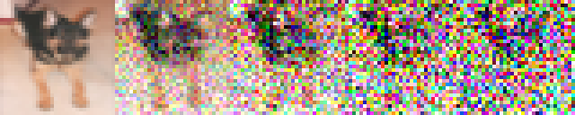
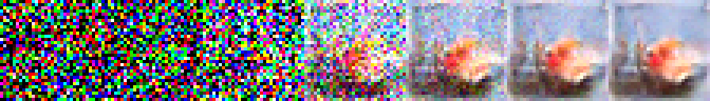
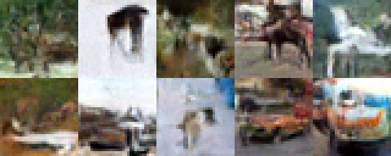

## Denoising Diffusion Probabilistic Models (DDPM)
Link to the paper:  https://arxiv.org/abs/2006.11239

Highlights:
### Part I: Diffusion Models and Latent Diffusion

- CIFAR-10 dataset is used for training (32px, 10 Classes)
- Adding noise step-by-step (forward process):

```math
q(\mathbf{x}_t \vert \mathbf{x}_{t-1}) = \mathcal{N}(\mathbf{x}_t; \sqrt{1 - \beta_t} \mathbf{x}_{t-1}, \beta_t\mathbf{I}) ,\ 
q(\mathbf{x}_{1:T} \vert \mathbf{x}_0) = \prod^T_{t=1} q(\mathbf{x}_t \vert \mathbf{x}_{t-1})
```

| Forward process (Step-by-Step) |
|-------------------------------|
| <p align="center"></p> |

- To train the neural network model at different time steps easily, we need to be able to apply all noise at once:
```math
q(\mathbf{x}_t \vert \mathbf{x}_0) = \mathcal{N}(\mathbf{x}_t; \sqrt{\bar{\alpha}_t} \mathbf{x}_0, (1 - \bar{\alpha}_t)\mathbf{I})
```
$$
 \ where: \bar{\alpha}_t = \prod_{i=1}^T \alpha_i, \  \alpha_t = 1- \beta_t
$$

| Forward process (All at once) | 
|---------------------|
|  |

- U-Net with attention has been chosen as denoising model
- A time embedding also used to index time steps
- Example denoising (Reverse) process:

| Reverse Process | 
|---------------------|
|  |

- Sample generated images:

| Generated images | 
|---------------------|
|  |

## Part2: Evaluating the Generated Samples:

- To Assess the generated images FID-score has been used. For this purpose, 100 image is generated and is compared with the images from original dataset. 
- To calculated FID-score, `pytorch-fid` package is used.

```math
FID = 250.96
```
