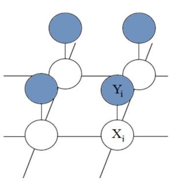
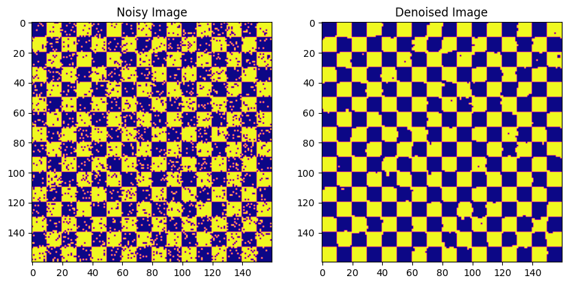

### Image denoising using Markov Random Field (MRF) and energy function

We know that for an image nearby pixels have close intensity values. We can leverage this relationship to reduce the noise in the image. Specifically, noise can change a pixel's intensity significantly, compared to it's neighbors, but by analyzing the relationship between neighboring pixels, this noise can be balanced. 

Consider a 2D binary image with pixel values $x_i \in $. Now consider having a noisy version of the same image with pixels $y_i$ that each pixel takes different value than $x_i$ with the probability of 0.1. Assuming that in the original image, pixels with a shared edge (neighbors) have related values, and that each noisy pixel is solely a function of its corresponding original pixel, we can represent this problem using the following Markov Random Field (MRF):

  

Assume that we use $\bar{X}$ to show the pixels of the original image, and $\bar{Y}$ to show the pixels of the noisy image. Based on the MRF shown above, We can define the following energy function for this problem:

$$
E(\bar{X}=x, \bar{Y}=y)= \alpha \sum_ix_i - \beta\sum_{i,j}x_ix_j - \gamma \sum_i x_iy_i
$$

The expression $-\gamma x_i y_i$:
- Represents the correlation between the pixels of the original (noise-free) image and the noisy image.
- Considering that each pixel in the noisy image has a 0.1 probability of being the opposite of the original pixel, the correlation between the two pixels will be high. 
- Since $\gamma>0$, when $x_i$ and $y_i$ have the same sign, the energy is low (resulting in higher probability), and when they have opposite signs, the energy is high.

The expression $-\beta x_i x_j, \beta > 0$:
- $i$ and $j$ are the indices of neighboring pixels.
- Neighboring pixels are expected to have high correlation, so the energy function should be defined to have:
  - Low values (high probability) when $x_i$ and $x_j$ have the same sign
  - High values (low probability) when $x_i$ and $x_j$ have the opposite sign

The expression $-\alpha x_i$:
- Is model's bias. It adjusts the probability of a pixel being $+1$ or $-1$.
- If $\alpha = 0$, it means each pixel can take $+1$ or $-1$ values with equal probability.

---
The result of denoising by minimizing the energy function is depicted below:

  

