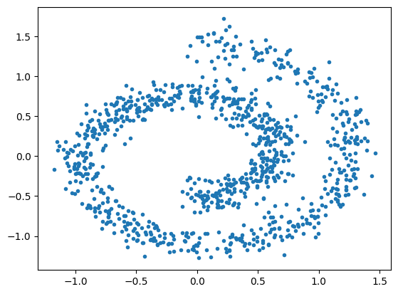
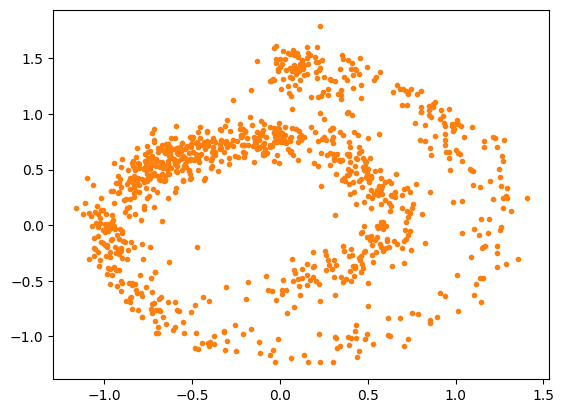
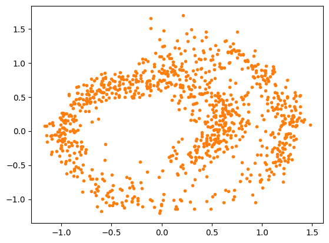

### Score Matching

## Part I

- Trains a neural network with the score matching function below:

```math
\mathcal{L}(\theta) = \mathbb{E}_{\mathbf{x} \sim p(\mathbf{x})} \left[ \frac{1}{2} \left\lVert \mathbf{s}_\theta(\mathbf{x}) \right\rVert^2 + \mathrm{tr} \left( \nabla_\mathbf{x} \mathbf{s}_\theta(\mathbf{x}) \right) \right]
```


- Then generates samples using Langevin Dynamics:

```math
\mathbf{x}_{i + 1} = \mathbf{x}_i + \varepsilon \nabla_\mathbf{x}\mathrm{log}\ p(\mathbf{x}) + \sqrt{2\varepsilon} \mathbf{z}_i 
```

```math
where \quad \mathbf{z}_i\sim\mathcal{N}(\mathbf{0}, \mathbf{I})
```
- Figure below shows the original samples and generated samples:

| Original Samples | Generated Samples |
|-----------------|-----------------|
|  |  |

- It is evident that generated samples are not equally distributed and some parts are more dense. Furthermore, calculation of the Jacobian matrix is expensive at higher dimensions.

## Part II
- Trains a neural network with the denoising score matching function below:

```math
\begin{align*}

\mathcal{L}(\theta) &= \frac{1}{L}\sum_{i=1}^{L}{λ(σ_i)}\mathbb{E}_{\mathbf{x}\sim p(\mathbf{x}), \mathbf{\tilde{x}}\sim q_{σ_i}(\mathbf{\tilde{x}|x})}\left[\frac{1}{2} \left\lVert\mathbf{s_\theta}(\mathbf{\tilde{x}, σ_i}) - \nabla_\mathbf{\tilde{x}} \mathbf{log q_{σ_i}}(\mathbf{\tilde{x}|x})\right\rVert^2\right] \\
&=\frac{1}{L}\sum_{i=1}^{L}\mathbb{E}_{\mathbf{x}\sim p(\mathbf{x}), \mathbf{z}\sim\mathcal{N}(\mathbf{0}, \mathbf{I})}\left[\frac{1}{2} \left\lVert\mathbf{\sigma_i s_\theta}(\mathbf{x+σ_iz, σ_i})+ z\right\rVert^2\right] + const.

\end{align*}
```

- The neural network takes one additional input for the noise in $t_i$
- Then generates sample using Annealed Langevin Dynamics:

```math
\begin{equation*}
\mathbf{x}_{i + 1} = \mathbf{x}_i + \frac{α_i}{2}\mathbf{s_\theta}(\mathbf{x+σ_iz, σ_i}) + \sqrt{\alpha_i}\mathbf{z}_i
\end{equation*}
```

```math
where \quad \mathbf{z}_i\sim\mathcal{N}(\mathbf{0}, \ \mathbf{I}), \mathbf{α_i=ϵ.\frac{σ_i}{σ_L}}
```

- Figure below shows the original samples and generated samples:

| Original Samples | Generated Samples |
|---------------------|---------------------|
|  |  |
- Figure below shows a comparison of the generated samples using Langevin Dynamics and Annealed Langevin Dynamics:

| Langevin Dynamics | Annealed Langevin Dynamics |
|---------------------|---------------------|
|  |  |

- It can be seen that generated samples using Annealed Langevin Dynamics has more proportionate distribution.
